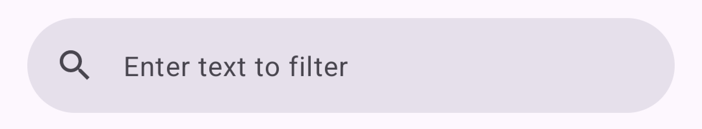
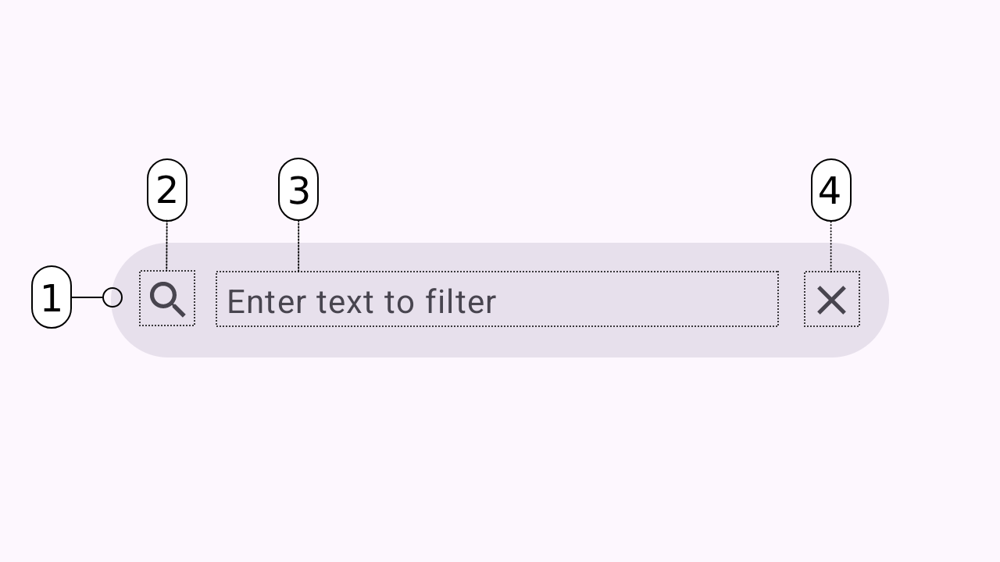

# Search Bar View

[Search Bar](https://m3.material.io/components/search/overview) is a Material Design component that helps users to search through a collection of content using a Search View component.

This implementation provides a direct input search bar that follows Material Design 3 guidelines while maintaining the ability to be customized.



**Contents**
1. [Using search bar](#using-search-bar)
2. [Implementation](#implementation)
3. [Theming](#theming)
4. [Attributes](#attributes)
5. [States](#states)

## Using search bar

The search bar provides a text input field with search and clear icons. It supports both direct text input and search submission.

### Installation

Add the dependency:

```gradle
dependencies {
    implementation("com.github.IgniteCoders:SearchBarView:1.0.1")
}
```

Add the jitpack repository to you setting.gradle.kts:
```gradle
dependencyResolutionManagement {
    repositoriesMode.set(RepositoriesMode.FAIL_ON_PROJECT_REPOS)
    repositories {
        mavenCentral()
        maven { url = uri("https://jitpack.io") }
    }
}
```

### Basic usage

```xml
<com.ignite.searchbarview.SearchBarView
    android:id="@+id/searchBar"
    android:layout_width="match_parent"
    android:layout_height="wrap_content" />
```

### Handling input

```kotlin
searchBar.setOnQueryTextChangeListener { newText ->
    // Handle text changes
}

searchBar.setOnQueryTextSubmitListener { query ->
    // Handle search submission
}
```

### XML attributes example

```xml
<com.ignite.searchbarview.SearchBarView
    android:id="@+id/searchBar"
    android:layout_width="match_parent"
    android:layout_height="wrap_content"
    app:hint="Search items..."
    app:textAppearance="@style/TextAppearance.Material3.BodyLarge"
    app:backgroundColor="?attr/colorSurfaceVariant"
    app:textColor="?attr/colorOnSurface"
    app:iconTint="?attr/colorOnSurfaceVariant" />
```

## Implementation

### Anatomy



1. Container
2. Leading search icon
3. Input text field
4. Trailing clear icon

### Behavior

- The search bar expands to fill its layout width
- The clear icon appears when text is entered and clears the input when tapped
- Ripple effect is shown on touch when the search bar is not focused
- The input field gains focus when the container is tapped

## Theming

### Tokens

The search bar supports the following Material Design tokens:

- Container color: `colorSurfaceVariant`
- Container outline: `colorOutline`
- Input text color: `colorOnSurface`
- Hint and icon color: `colorOnSurfaceVariant`

### Customization

All colors and dimensions can be customized through XML attributes or programmatically.

## Attributes

### Container attributes

| Element | Attribute | Related method(s) | Default value |
|---------|-----------|------------------|---------------|
| Height | `app:height` | `setHeight()` | `56dp` |
| Corner radius | `app:cornerRadius` | `setCornerRadius()` | `28dp` |
| Background color | `app:backgroundColor` | `setBackgroundColor()` | `?attr/colorSurfaceVariant` |
| Stroke color | `app:strokeColor` | `setStrokeColor()` | `?attr/colorOutline` |
| Stroke width | `app:strokeWidth` | `setStrokeWidth()` | `0dp` |
| Elevation | `app:elevation` | `setElevation()` | `0dp` |

### Text attributes

| Element | Attribute | Related method(s) | Default value |
|---------|-----------|------------------|---------------|
| Text appearance | `app:textAppearance` | `setTextAppearance()` | `?attr/textAppearanceBodyLarge` |
| Text color | `app:textColor` | `setTextColor()` | `?attr/colorOnSurface` |
| Hint text | `app:hint` | `setHint()` | `@string/search_hint` |
| Hint text color | `app:hintTextColor` | `setHintTextColor()` | `?attr/colorOnSurfaceVariant` |
| Text size | `app:textSize` | `setTextSize()` | System default |
| Font family | `app:textFont` | `setFontFamily()` | System default |
| Text style | `app:textStyle` | - | `normal` |

### Icon attributes

| Element | Attribute | Related method(s) | Default value |
|---------|-----------|------------------|---------------|
| Search icon | `app:leadingIcon` | `setLeadingIcon()` | `@drawable/ic_search` |
| Clear icon | `app:clearIcon` | `setClearIcon()` | `@drawable/ic_clear` |
| Search icon size | `app:leadingIconSize` | `setLeadingIconSize()` | `24dp` |
| Clear icon size | `app:clearIconSize` | `setClearIconSize()` | `24dp` |
| Icon tint | `app:iconTint` | `setIconTint()` | `?attr/colorOnSurfaceVariant` |

### Input attributes

| Element | Attribute | Related method(s) | Default value |
|---------|-----------|------------------|---------------|
| Enabled | `app:enabled` | `setEnabled()` | `true` |
| Max lines | `app:maxLines` | `setMaxLines()` | `1` |
| Max length | `app:maxLength` | `setMaxLength()` | No limit |
| Input type | `app:inputType` | `setInputType()` | `text` |
| IME options | `app:imeOptions` | `setImeOptions()` | `actionSearch` |

## States

### Enabled state

The search bar can be:
- Enabled (default)
- Disabled

```xml
<com.ignite.searchbarview.SearchBarView
    ...
    app:enabled="false" />
```

```kotlin
searchBar.isEnabled = false
```

### Focus state

The search bar has two focus states:
- Unfocused: Shows ripple effect on touch
- Focused: Shows keyboard and allows text input

## License

```
Copyright 2024 Ignite
Licensed under the Apache License, Version 2.0 (the "License");
``` 
